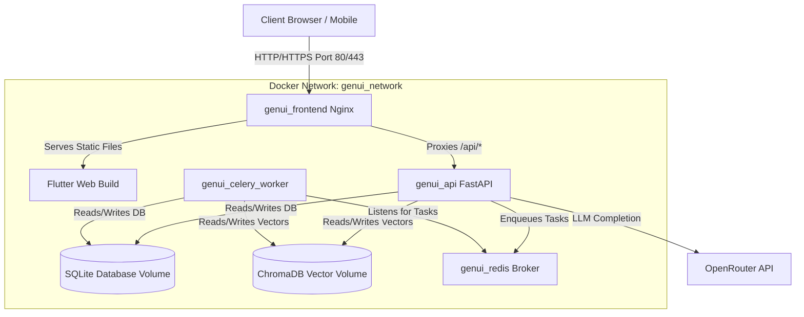

# 🐳 GenUI Docker Deployment Guide

This guide provides step-by-step instructions for deploying your fully Dockerized multi-container **GenUI** application. Since you have already fully dockerized the stack, deploying it is straightforward and highly reliable.

This guide covers:
1. **System Architecture Overview** (How the services interact)
2. **Local Deployment** (Quick execution on your local machine)
3. **Production VPS Deployment** (Deploying to a cloud server like AWS, DigitalOcean, or GCP)
4. **Enabling SSL / HTTPS** (Configuring Nginx & Let's Encrypt for production)
5. **Backup & Maintenance** (SQLite database & ChromaDB vectors)

---

## 1. System Architecture Overview

Your application is orchestrated using **Docker Compose** with four primary services:



> [!NOTE]
> **No Port Mapping Conflicts:** The frontend container acts as a single gateway. It exposes port `80` to the world and handles routing for both the Flutter UI and backend API requests (`/api/*`), preventing Cross-Origin Resource Sharing (CORS) issues in production.

---

## 2. Local Deployment

To run the application locally on your computer with Docker:

### A. Prerequisites
1. **Docker Desktop** installed and running on your machine.
2. An **OpenRouter API Key** for LLM functionality.
3. Your **Firebase Service Account JSON** file placed at `backend/firebase-service-account.json`.

### B. Launching via the Batch File (Windows)
We have provided a premium launcher script `run_genui.bat` in the root of the workspace.
1. Double-click or run `run_genui.bat` in your terminal.
2. Select **`[1] Docker - Full Stack (Frontend + Backend + Redis)`**.
3. The script will:
   - Check if Docker is running.
   - Prompt you for your OpenRouter API key to automatically build your `.env` file (if not already present).
   - Verify Firebase configurations.
   - Run `docker compose up -d --build`.
4. Once completed, access the application at:
   - **Frontend:** http://localhost:80
   - **API Docs:** http://localhost:8000/docs

### C. Manual Docker Compose Commands
If you prefer using the command line directly:
```bash
# Build and run all services in the background (detached mode)
docker compose up -d --build

# View container logs live
docker compose logs -f

# Shut down the application
docker compose down

# Shut down the application and completely reset local databases/volumes
docker compose down -v
```

---

## 3. Production VPS Deployment (AWS, GCP, DigitalOcean, Linode)

To deploy your dockerized app to a remote Linux server (typically **Ubuntu 22.04 LTS / 24.04 LTS**):

### Step A: Provision the Server and Set Up Firewall
1. Spin up a Virtual Private Server (VPS) with at least **2GB RAM** and **1 vCPU** (recommended for local vector embeddings processing).
2. Point your domain (e.g., `genui.yourdomain.com`) to the VPS's public IP address using an **A Record** in your DNS provider.
3. Configure your server's firewall (UFW) to only allow essential traffic:
   ```bash
   sudo ufw default deny incoming
   sudo ufw default allow outgoing
   sudo ufw allow ssh          # Port 22
   sudo ufw allow http         # Port 80
   sudo ufw allow https        # Port 443
   sudo ufw enable
   ```

### Step B: Install Docker & Docker Compose
Connect to your VPS via SSH and install Docker:
```bash
# Update package database
sudo apt update && sudo apt upgrade -y

# Install Docker dependencies
sudo apt install -y apt-transport-https ca-certificates curl software-properties-common

# Add Docker’s official GPG key
curl -fsSL https://download.docker.com/linux/ubuntu/gpg | sudo gpg --dearmor -o /usr/share/keyrings/docker-archive-keyring.gpg

# Set up the stable repository
echo "deb [arch=$(dpkg --print-architecture) signed-by=/usr/share/keyrings/docker-archive-keyring.gpg] https://download.docker.com/linux/ubuntu $(lsb_release -cs) stable" | sudo tee /etc/apt/sources.list.d/docker.list > /dev/null

# Install Docker Engine
sudo apt update
sudo apt install -y docker-ce docker-ce-cli containerd.io

# Install Docker Compose Plugin
sudo apt install -y docker-compose-plugin

# Verify installation (should show Docker version)
docker --version
docker compose version
```

### Step C: Deploy Your Code
1. Clone your project repository onto the server:
   ```bash
   git clone https://github.com/yourusername/your-repo-name.git /opt/genui
   cd /opt/genui
   ```
2. Create and configure your production `.env` file:
   ```bash
   cp .env.example .env
   nano .env
   ```
   Modify the variables to reflect a secure **production environment**:
   ```ini
   # -- Production Application Config --
   APP_ENV=production
   APP_PORT=8000
   FRONTEND_PORT=80
   DEBUG=false
   SECRET_KEY=paste-a-long-random-secure-string-here # Generate using: openssl rand -hex 32
   
   # -- OpenRouter AI Credentials --
   OPENROUTER_API_KEY=your-production-openrouter-key-here
   OPENROUTER_MODEL=google/gemini-2.5-flash
   
   # -- Firebase Configuration --
   FIREBASE_SERVICE_ACCOUNT_PATH=./firebase-service-account.json
   
   # -- Security & CORS Settings --
   # Only allow your actual domain to communicate with the API
   ALLOWED_ORIGINS=https://genui.yourdomain.com,http://genui.yourdomain.com
   ```
3. Upload your Firebase private key to `/opt/genui/backend/firebase-service-account.json` using `scp` or pasting it on the server:
   ```bash
   nano backend/firebase-service-account.json
   ```

### Step D: Run the Production Build
Run Docker Compose. It will build production-optimized, multi-stage, non-root runner images for maximum speed and security:
```bash
sudo docker compose up -d --build
```
Check if all containers are healthy:
```bash
sudo docker compose ps
```

---

## 4. Enabling SSL / HTTPS (Production Ready)

To protect user credentials and authentication cookies, **HTTPS is mandatory**. The cleanest method is to run a lightweight Nginx reverse proxy on the host machine to handle SSL encryption, which then forwards secure traffic to your dockerized frontend.

### Step A: Install Nginx and Certbot on the Host Machine
```bash
sudo apt update
sudo apt install -y nginx certbot python3-certbot-nginx
```

### Step B: Configure Host Nginx Server Block
Create a config file for your domain:
```bash
sudo nano /etc/nginx/sites-available/genui
```
Paste the following server block (replacing `genui.yourdomain.com` with your actual domain):
```nginx
server {
    listen 80;
    server_name genui.yourdomain.com;

    # Forward all normal web and api traffic directly to the Docker Frontend container
    location / {
        proxy_pass http://127.0.0.1:80; # Directs to port mapped by docker-compose
        proxy_set_header Host $host;
        proxy_set_header X-Real-IP $remote_addr;
        proxy_set_header X-Forwarded-For $proxy_add_x_forwarded_for;
        proxy_set_header X-Forwarded-Proto $scheme;
    }
}
```
Enable the site and restart Nginx:
```bash
sudo ln -s /etc/nginx/sites-available/genui /etc/nginx/sites-enabled/
sudo rm /etc/nginx/sites-enabled/default # Remove default site if active
sudo nginx -t # Test configuration syntax
sudo systemctl restart nginx
```

### Step C: Generate Let's Encrypt SSL Certificates
Run Certbot to automate SSL certificate retrieval and automatically update your Nginx configuration to enforce HTTPS:
```bash
sudo certbot --nginx -d genui.yourdomain.com
```
Follow the interactive prompts (enter email, agree to terms, and select **"Redirect"** to force all traffic from HTTP to secure HTTPS).

Now, your application is fully secure and online at `https://genui.yourdomain.com`!

---

## 5. Backup & Maintenance

Because your app is fully dockerized, all application state is persisted inside isolated Docker volumes.

### A. Volume Locations
In your `docker-compose.yml`, volumes are mounted locally on the server:
- `sqlite_data` (Contains your `fberaucracy.db` user/app tables)
- `chroma_data` (Contains your vector store embeddings database)

To find where these volumes are physically saved on your VPS host disk:
```bash
sudo docker volume inspect genui_sqlite_data
sudo docker volume inspect genui_chroma_data
```
Usually, they reside under `/var/lib/docker/volumes/genui_sqlite_data/_data`.

### B. Creating Backups
You can safely back up your SQLite database without shutting down the containers:
```bash
# Create a folder for backups
mkdir -p /opt/genui/backups

# Safely query SQLite to output a backup copy
sudo docker exec genui_api sqlite3 /app/data/fberaucracy.db ".backup '/app/data/backup_$(date +%F).db'"

# Move the backup file out of the volume onto the host filesystem
sudo mv /var/lib/docker/volumes/genui_sqlite_data/_data/backup_*.db /opt/genui/backups/
```

### C. Updating Your Application
When you push code updates, updating the production server is highly efficient:
```bash
cd /opt/genui
git pull
sudo docker compose up -d --build
```
Because of Docker's layer caching and multi-stage builds, only changed files are rebuilt, resulting in minimal deployment downtime (less than 5 seconds)!
