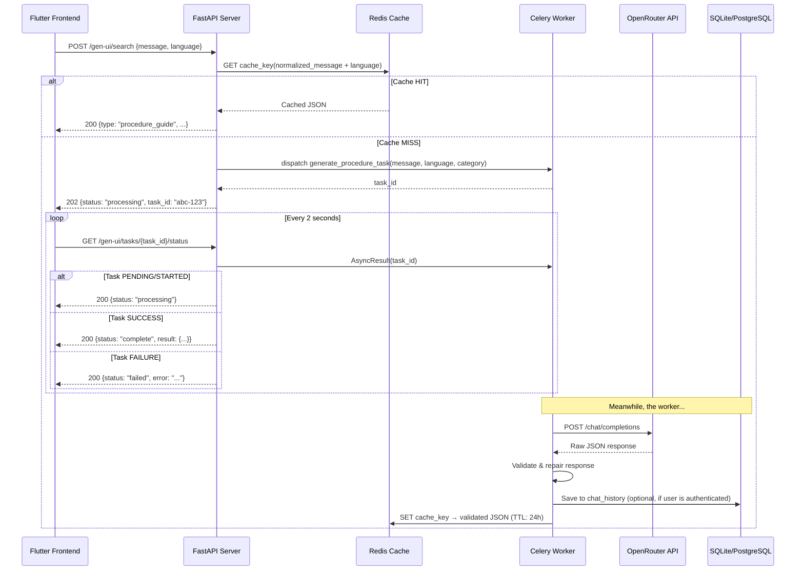

# Redis + Celery Caching & Async Task Queue — System Design

## Problem Statement

The `/api/v1/gen-ui/search` endpoint currently makes a **synchronous** OpenRouter API call on every request. This creates two problems:
1. **Traffic spikes** — Multiple concurrent requests to a slow external API (up to 90s timeout) can exhaust workers and crash the app.
2. **Redundant API costs** — Identical or near-identical queries re-hit OpenRouter every time, wasting money.

## Solution Overview



---

## Key Design Decisions

> [!IMPORTANT]
> **Framework Correction** — Your app is **FastAPI** (not Django). Celery works with FastAPI, but the integration pattern is different: we initialize Celery as a standalone module and import tasks directly — there's no Django `CELERY_APP` autodiscovery. This plan is designed for FastAPI.

> [!IMPORTANT]
> **Why Celery over FastAPI BackgroundTasks?** — FastAPI's built-in `BackgroundTasks` runs in the same process and event loop. If the server restarts, all background work is lost. Celery gives us: (1) a **separate worker process** that survives server restarts, (2) built-in **task status tracking** via `AsyncResult`, (3) **retry/failure handling**, and (4) a foundation for future scaling (multiple workers).

### Cache Key Normalization Strategy

The cache key will be built from:
```
sahil:cache:{sha256(normalized_message + "|" + language)}
```

**Normalization** (lightweight, exact-match with slight forgiveness):
1. `.strip()` — remove leading/trailing whitespace
2. `.lower()` — case-insensitive matching
3. Collapse multiple spaces → single space
4. Remove trailing punctuation (`?`, `.`, `!`)

This means `"How do I renew my carte grise?"` and `"how do i renew my carte grise"` will be cache hits, but `"renew carte grise"` will NOT (that's a different query — not a fuzzy match, which is intentional for accuracy).

### Cache TTL

**24 hours** — Tunisian bureaucratic procedures don't change frequently. A 24h TTL provides excellent cost savings while ensuring information doesn't go stale.

---

## Proposed Changes

### Infrastructure — Redis & Celery Services

#### [MODIFY] [docker-compose.yml](file:///c:/Users/User/Desktop/FbureaucracyTN/backend/docker-compose.yml)

Add two new services:

| Service | Image | Purpose | Port |
|---------|-------|---------|------|
| `redis` | `redis:7-alpine` | Cache store + Celery broker/backend | 6379 |
| `celery_worker` | Built from same `Dockerfile` | Runs `celery -A app.celery_app worker` | N/A |

Redis serves **dual purpose**: it is both the cache (for exact-match lookups) and the Celery message broker + result backend. This keeps the architecture simple — one dependency, not two.

#### [MODIFY] [requirements.txt](file:///c:/Users/User/Desktop/FbureaucracyTN/backend/requirements.txt)

Add:
```
celery[redis]==5.4.0
redis==5.2.1
```

#### [MODIFY] [.env](file:///c:/Users/User/Desktop/FbureaucracyTN/backend/.env) / [.env.example](file:///c:/Users/User/Desktop/FbureaucracyTN/backend/.env.example)

Add:
```env
# Redis
REDIS_URL=redis://localhost:6379/0

# Cache
CACHE_TTL_SECONDS=86400
CACHE_ENABLED=true
```

---

### Backend — New Files

#### [NEW] `app/celery_app.py`

**Purpose**: Celery application factory. Creates and configures the Celery instance.

```python
# What it does:
# 1. Creates a Celery() instance using REDIS_URL as both broker and backend
# 2. Configures serialization (JSON), timezone, task acks
# 3. Autodiscovers tasks from app.tasks
```

**Key config**:
- `broker_url` = `settings.REDIS_URL`
- `result_backend` = `settings.REDIS_URL`
- `task_serializer` = `"json"`
- `result_expires` = `3600` (task results kept for 1 hour, separate from cache TTL)
- `task_acks_late` = `True` (worker acknowledges after completion, not on pickup — prevents task loss on crash)

#### [NEW] `app/tasks.py`

**Purpose**: Defines the Celery task that does the heavy lifting.

```python
# Task: generate_procedure_task(user_message, language, category)
#
# 1. Build RAG context (sync wrapper around the async rag_service)
# 2. Call OpenRouter via gemini_service (sync wrapper)
# 3. Validate/repair the response via validators.py
# 4. Store validated JSON in Redis cache with 24h TTL
# 5. Return the validated JSON dict as the task result
```

> [!NOTE]
> Since Celery workers run in a **synchronous** context but your services are `async`, the task will use `asyncio.run()` to bridge the gap. This is safe because each Celery worker thread/process has its own event loop.

#### [NEW] `app/cache.py`

**Purpose**: Redis caching utility module. Encapsulates all cache read/write logic.

```python
# Functions:
#
# normalize_query(message: str) -> str
#     Strips, lowercases, collapses spaces, removes trailing punctuation
#
# make_cache_key(message: str, language: str) -> str
#     Returns "sahil:cache:{sha256(normalized + '|' + language)}"
#
# get_cached_response(message: str, language: str) -> Optional[dict]
#     Checks Redis for the key. Returns parsed JSON dict or None.
#
# set_cached_response(message: str, language: str, response: dict) -> None
#     Stores JSON in Redis with the configured TTL.
#
# get_redis_client() -> redis.Redis
#     Returns a singleton Redis connection (lazy-initialized).
```

**Data structure in Redis**:
```
Key:   "sahil:cache:a1b2c3d4e5..."  (SHA-256 hex digest)
Value: '{"type":"procedure_guide","title":{...},...}'  (JSON string)
TTL:   86400 seconds (24 hours)
```

---

### Backend — Modified Files

#### [MODIFY] [config.py](file:///c:/Users/User/Desktop/FbureaucracyTN/backend/app/core/config.py)

Add new settings fields to the `Settings` class:

```python
# ── Redis / Celery ────────────────────────────────
REDIS_URL: str = Field(default="redis://localhost:6379/0")
CACHE_TTL_SECONDS: int = Field(default=86400)    # 24 hours
CACHE_ENABLED: bool = Field(default=True)
```

#### [MODIFY] [gen_ui.py](file:///c:/Users/User/Desktop/FbureaucracyTN/backend/app/api/routes/gen_ui.py)

This is the **most critical change**. The current synchronous flow:

```
Request → RAG → OpenRouter → Validate → Return
```

Becomes:

```
Request → Check Cache → (HIT: return cached) / (MISS: dispatch Celery task → return task_id)
```

**New endpoint** added to the same router:
```python
@router.get("/tasks/{task_id}/status")
async def get_task_status(task_id: str):
    """Polling endpoint — returns task status + result when complete."""
```

**Response schemas for the new flow**:

| Scenario | HTTP Status | Response Body |
|----------|-------------|---------------|
| Cache hit | `200` | `ProcedureGuideResponse` (unchanged) |
| Cache miss → task dispatched | `202` | `{"status": "processing", "task_id": "uuid"}` |
| Poll: still running | `200` | `{"status": "processing", "task_id": "uuid"}` |
| Poll: complete | `200` | `{"status": "complete", "result": {ProcedureGuideResponse}}` |
| Poll: failed | `200` | `{"status": "failed", "error": "human-readable message"}` |

#### [MODIFY] [responses.py](file:///c:/Users/User/Desktop/FbureaucracyTN/backend/app/schemas/responses.py)

Add two new Pydantic models:

```python
class TaskAcceptedResponse(BaseModel):
    """Returned when a cache miss triggers a background task."""
    status: Literal["processing"] = "processing"
    task_id: str

class TaskStatusResponse(BaseModel):
    """Returned by the polling endpoint."""
    status: Literal["processing", "complete", "failed"]
    task_id: str
    result: Optional[Dict[str, Any]] = None   # Present when status == "complete"
    error: Optional[str] = None                # Present when status == "failed"
```

#### [MODIFY] [main.py](file:///c:/Users/User/Desktop/FbureaucracyTN/backend/app/main.py)

- Add Redis connection check in the `lifespan` startup (log a warning if Redis is unreachable — don't crash, the app can still function without cache in dev).
- Add Redis connection cleanup in shutdown.

---

### Frontend — Modified Files

#### [MODIFY] [http_api_service.dart](file:///c:/Users/User/Desktop/FbureaucracyTN/frontend/lib/core/api/http_api_service.dart)

Modify the `getProcedureDetail` method to handle the new async flow:

```dart
// Current:
//   POST /gen-ui/search → wait for full response → return ProcedureModel
//
// New:
//   POST /gen-ui/search
//     → If 200 with "type: procedure_guide"  → cache hit, return immediately
//     → If 202 with "status: processing"     → start polling loop:
//         GET /gen-ui/tasks/{task_id}/status every 2 seconds
//         Until status == "complete" or "failed" or timeout (60s max)
```

#### [MODIFY] [api_service.dart](file:///c:/Users/User/Desktop/FbureaucracyTN/frontend/lib/core/api/api_service.dart)

No change needed — the `ApiService` interface stays the same. `getProcedureDetail(slug)` still returns `Future<ProcedureModel>`. The polling logic is an implementation detail inside `HttpApiService`.

#### [MODIFY] [app_config.dart](file:///c:/Users/User/Desktop/FbureaucracyTN/frontend/lib/core/api/app_config.dart)

```dart
static const Duration pollInterval = Duration(seconds: 2);
static const Duration maxPollDuration = Duration(seconds: 120);
// Increase requestTimeout since we may now poll for longer
static const Duration requestTimeout = Duration(seconds: 120);
```

---

## Files Summary

| Action | File | Description |
|--------|------|-------------|
| **NEW** | `app/celery_app.py` | Celery application instance & config |
| **NEW** | `app/tasks.py` | `generate_procedure_task` background task |
| **NEW** | `app/cache.py` | Redis cache read/write utilities |
| **MODIFY** | `app/core/config.py` | Add `REDIS_URL`, `CACHE_TTL_SECONDS`, `CACHE_ENABLED` |
| **MODIFY** | `app/api/routes/gen_ui.py` | Cache check → Celery dispatch → polling endpoint |
| **MODIFY** | `app/schemas/responses.py` | Add `TaskAcceptedResponse`, `TaskStatusResponse` |
| **MODIFY** | `app/main.py` | Redis health check on startup/shutdown |
| **MODIFY** | `docker-compose.yml` | Add `redis` and `celery_worker` services |
| **MODIFY** | `requirements.txt` | Add `celery[redis]`, `redis` |
| **MODIFY** | `.env` / `.env.example` | Add Redis/cache env vars |
| **MODIFY** | `frontend/.../http_api_service.dart` | Polling logic for 202 responses |
| **MODIFY** | `frontend/.../app_config.dart` | Add poll interval/timeout constants |

---

## What Stays Untouched

- `gemini_service.py` — Called by the Celery task, not modified
- `rag_service.py` — Called by the Celery task, not modified  
- `validators.py` — Called by the Celery task, not modified
- `chat.py` route — Authenticated chat endpoint, unrelated to this change
- `models.py` — No new database tables needed (cache lives in Redis, task results in Celery's Redis backend)
- `api_service.dart` — Interface unchanged, polling is an internal implementation detail

---

## Open Questions

> [!IMPORTANT]
> **1. Should the `/chat` endpoint also use caching/queueing?**  
> Currently this plan only modifies `/gen-ui/search` (the public endpoint). The `/chat` endpoint is authenticated and persists to history. Should it also get cache + Celery treatment, or is that a separate phase?

> [!IMPORTANT]
> **2. Redis in local development — Docker or native install?**  
> For local dev on Windows, do you want to:
> - (a) Run Redis via Docker only (`docker-compose up redis`), or
> - (b) Install Redis natively (via WSL or Memurai for Windows)?
> 
> The plan assumes option (a) — you'll run `docker-compose up redis` and then `celery -A app.celery_app worker` manually during dev. The `CACHE_ENABLED=true/false` flag lets you disable caching entirely if Redis isn't running.

> [!IMPORTANT]
> **3. Cache invalidation policy**  
> Beyond the 24h TTL auto-expiry, do you want an admin endpoint to manually flush the cache (e.g., `DELETE /admin/cache` or `DELETE /admin/cache/{query}`)? This would be useful if you update RAG documents and want fresh results immediately.

---

## Verification Plan

### Automated Tests
1. **Unit test `cache.py`** — Test `normalize_query`, `make_cache_key`, cache hit/miss with a mock Redis
2. **Unit test `tasks.py`** — Mock OpenRouter, verify the task returns validated JSON and writes to cache
3. **Integration test `gen_ui.py`** — Test the full flow: cache miss → 202 → poll → 200 complete

### Manual Verification
1. Start Redis via `docker-compose up redis`
2. Start Celery worker: `celery -A app.celery_app worker --loglevel=info`
3. Start FastAPI: `uvicorn app.main:app --reload`
4. First request: verify 202 + polling works → result returned
5. Second identical request: verify instant 200 cache hit
6. Check Redis CLI: `redis-cli GET "sahil:cache:..."` confirms cached data
7. Flutter frontend: verify the search → result flow works with the new polling UX
