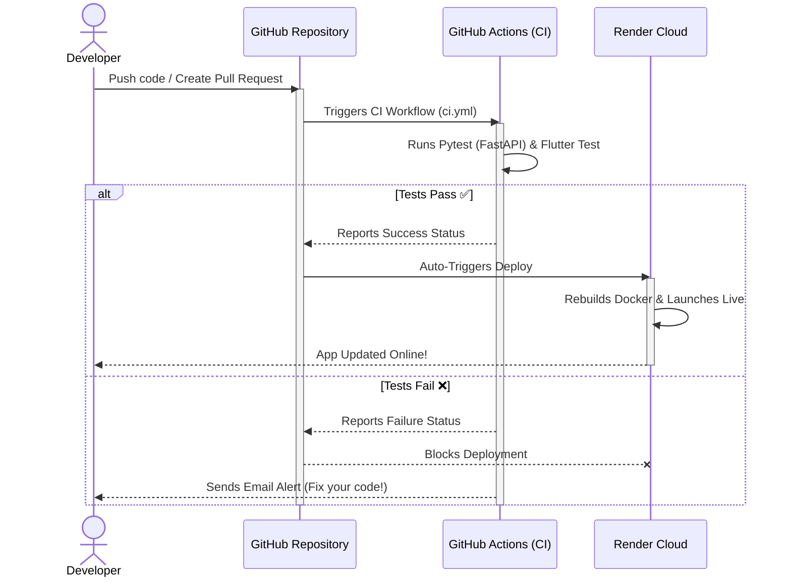

# 🚀 Step-by-Step Render & GitHub Actions Deployment Guide

This guide explains how to host your dockerized **GenUI** application on **Render.com** and set up automated testing using **GitHub Actions**.

---

## 🔒 Step 1: Secure Your Secrets (Crucial)

Before pushing your code to GitHub, ensure you do **NOT** upload your private credentials.

1. Open your **`.gitignore`** in both backend and frontend.
2. Ensure `firebase-service-account.json` is listed so it is ignored by git.
3. Open your `.env` file and verify it is not tracked by Git.

> [!WARNING]
> If you commit your private Firebase JSON file to a public GitHub repository, anyone can access your Firebase database. We will handle this securely using **Render Secret Files**.

---

## 💻 Step 2: Push Your Code to GitHub

1. Create a new repository on [GitHub](https://github.com) (e.g., `genui-app`).
2. Open your terminal in the root of your project and run:
   ```bash
   git init
   git add .
   git commit -m "feat: setup docker, render blueprint, and github actions"
   git branch -M main
   git remote add origin https://github.com/YOUR_GITHUB_USERNAME/YOUR_REPO_NAME.git
   git push -u origin main
   ```

3. As soon as you push, **GitHub Actions** will automatically start running your tests defined in `.github/workflows/ci.yml`. You can monitor this under the **"Actions"** tab of your repository!

---

## 🎨 Step 3: Set Up Your Stack on Render (1-Click Blueprint)

We have created a **`render.yaml`** Blueprint specification in your project root. Render will use this file to automatically provision your Redis database, FastAPI Backend + Celery Worker, and Flutter Frontend.

1. Go to the [Render Dashboard](https://dashboard.render.com) and log in.
2. Click the **New +** button in the top right and select **Blueprint**.
3. Connect your GitHub account and select your **`YOUR_REPO_NAME`** repository.
4. Render will read your `render.yaml` file and show a list of the 3 services it is about to create:
   * 🗄️ **redis** (Redis KV Store)
   * ⚙️ **api** (FastAPI Web Service + Celery background worker)
   * 🖥️ **frontend** (Flutter Web Nginx Web Service)
5. Under the **api** service configuration on the screen, fill in:
   * **`OPENROUTER_API_KEY`**: Paste your OpenRouter API key.
6. Click **Apply**. Render will start building and spinning up all three services in parallel!

---

## 🔑 Step 4: Upload Your Firebase Secret File on Render

Since your Firebase key was not pushed to GitHub, we must upload it securely directly to Render:

1. In the Render Dashboard, click on your **`api`** service.
2. Go to the **Environment** tab on the left menu.
3. Scroll down to the **Secret Files** section.
4. Click **Add Secret File**.
5. Set the filename exactly to: `firebase-service-account.json`.
6. Copy the **entire text contents** of your local `backend/firebase-service-account.json` file and paste it into the text box.
7. Click **Save Changes**.

Render will automatically restart your backend container, securely mounting your Firebase credential under `/etc/secrets/firebase-service-account.json` (the exact secure path we configured in your blueprint!).

---

## 🔄 Step 5: Finalize CORS Settings (Security Hardening)

Once the deployment finishes, Render will give you two public URLs:
* A frontend URL (e.g., `https://frontend-xxxx.onrender.com`)
* A backend URL (e.g., `https://api-xxxx.onrender.com`)

To secure your API from unauthorized requests:
1. Copy your public **frontend URL** (including the `https://`).
2. Go to the **Environment** tab of your **`api`** service on Render.
3. Find the `ALLOWED_ORIGINS` environment variable.
4. Change its value from `*` to your actual frontend URL (e.g., `https://frontend-xxxx.onrender.com`).
5. Click **Save Changes** to redeploy the API with strong production security!

---

## 🚀 How Your CI/CD Pipeline Works Now

Every time you want to make changes to your application:


You are now running a **fully modern, secure, automated dev-ops pipeline**!
